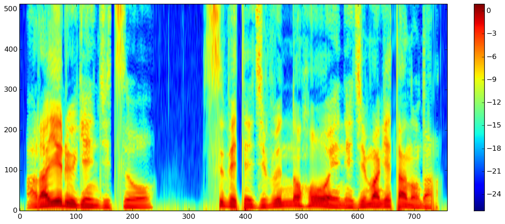
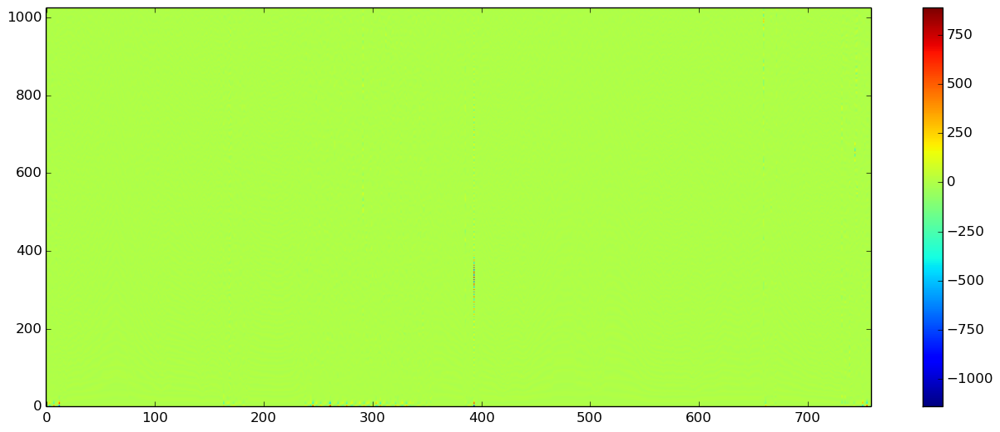

# WORLD.jl

[](https://travis-ci.org/r9y9/WORLD.jl)

**[NOT stable yet]** WORLD.jl is a Julia wrapper for WORLD - a high-quality speech analysis, modification and synthesis system. WORLD provides a way to decompose a speech signal into

- Fundamental frequency (F0)
- spectral envelope
- excitation signal (or aperiodicy used in TANDEM-STRAIGHT)

and re-synthesis a speech signal from these paramters. See [here](http://ml.cs.yamanashi.ac.jp/world/english/index.html) for the original WORLD.

## API

### Basic setup

```julia
period = 5.0
w = World(fs, period) # fs might be 16000, 22100 or 44100
```

This is not necessary but might be useful. The composite type `World` just holds sample frequency and frame period that are used during analysis. You can call WORLD functions directly as well.

Suppose `x::Array{Float64}` is a input monoral speech signal like


### DIO

```julia
opt = DioOption(80.0, 640, 2.0, period, 4) # f0floor, f0ceil, channels in octave, period, speed
f0, timeaxis = dio(w, x, opt=opt) # or you can write `dio(fs, x, opt=opt)` without using composite type `World`
```


### StoneMask

```julia
f0 = stonemask(w, x, timeaxis, f0)
```


### CheapTrick

```julia
spectrogram = cheaptrick(w, x, timeaxis, f0)
```


### Star

```julia
spectrogram = star(w, x, timeaxis, f0)
```



### Platinum

```julia
residual = platinum(w, x, timeaxis, f0, spectrogram)
```



### Synthesis

```julia
y = synthesis(w, f0, spectrogram, residual, length(x))
```


### Aperiodicity ratio

```julia
aperiodicity = aperiodicityratio(w, x, f0, timeaxis)
```


### Synthesis from aperiodicity

```julia
y = synthesis_from_aperiodicity(w, f0, spectrogram, aperiodicity, length(x))
```


