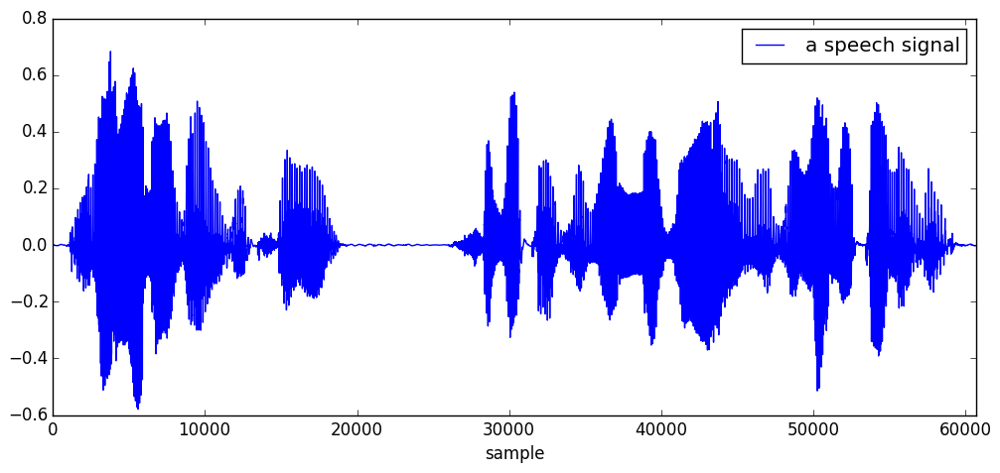
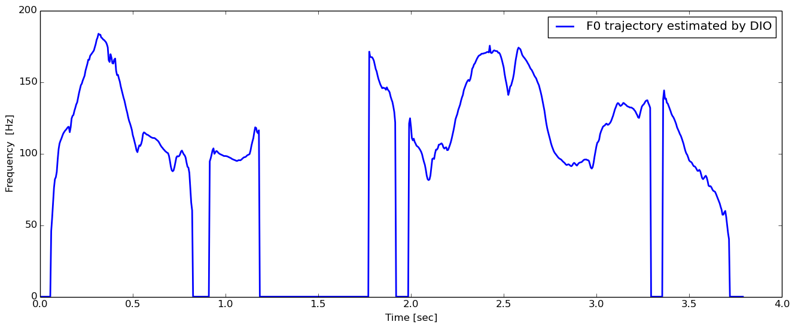
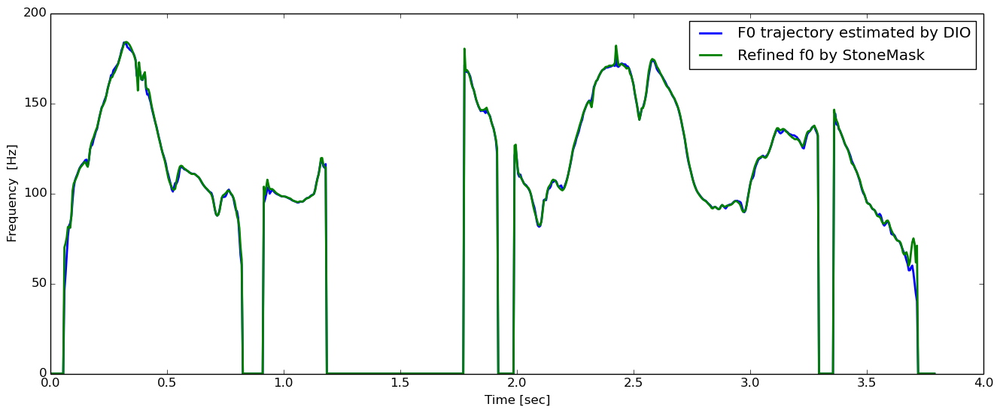
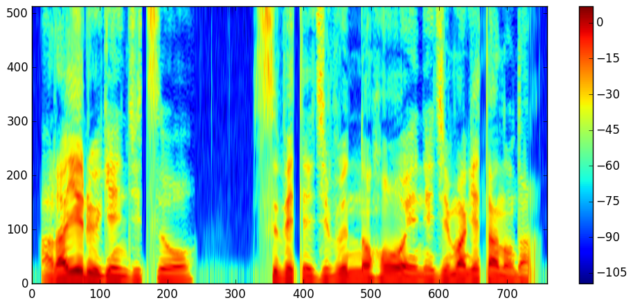
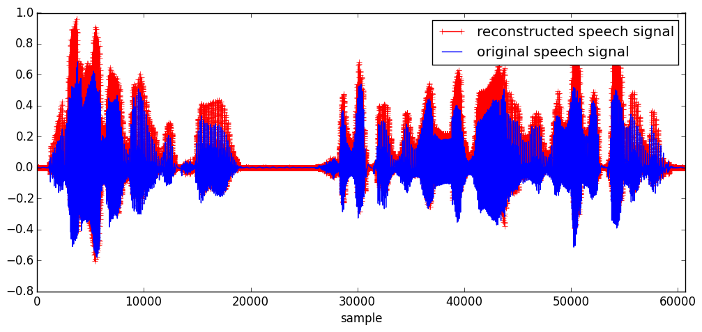
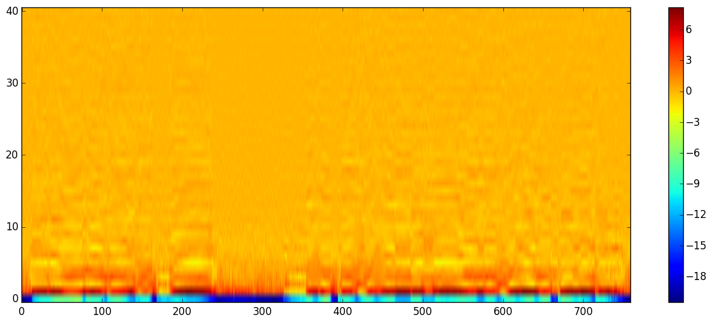
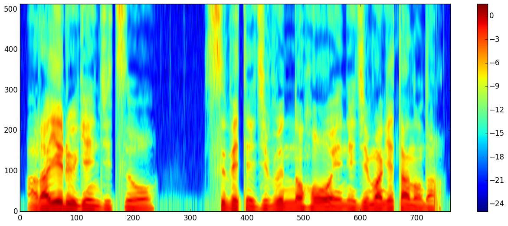
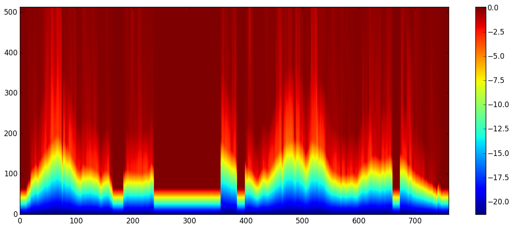

# WORLD.jl

[](https://travis-ci.org/r9y9/WORLD.jl)
[](https://ci.appveyor.com/project/r9y9/world-jl/branch/master)
[](https://coveralls.io/r/r9y9/WORLD.jl?branch=master)
[](http://pkg.julialang.org/?pkg=WORLD&ver=0.3)
[](http://pkg.julialang.org/?pkg=WORLD&ver=0.4)
[](http://pkg.julialang.org/?pkg=WORLD&ver=0.5)
[](LICENSE.md)

WORLD.jl is a Julia wrapper for [WORLD](http://ml.cs.yamanashi.ac.jp/world/english/index.html) - a high-quality speech analysis, manipulation and synthesis system. WORLD provides a way to decompose a speech signal into

- Fundamental frequency (F0)
- spectral envelope
- aperiodicity

and re-synthesize a speech signal from these paramters. Please see the project page for more details on the WORLD.

**NOTE**: WORLD.jl is based on a modified version of WORLD ([r9y9/WORLD](https://github.com/r9y9/WORLD)).

## Supported Platforms

- Linux
- Mac OS X
- Windows

## Installation

Run the following commands on your julia interactive settion (REPL):

```julia
julia> Pkg.add("WORLD")
```

if you want the latest master, run

```julia
julia> Pkg.clone("https://github.com/r9y9/WORLD.jl")
julia> Pkg.build("WORLD")
```

All dependencies are resolved with `Pkg.clone` and `Pkg.build`.

## Usage

In the following examples, suppose `x::Vector{Float64}` is a input monoral speech signal like



### F0 estimation and refinement

#### DIO

```julia
opt = DioOption(f0floor=71.0, f0ceil=800.0, channels_in_octave=2.0, period=period, speed=1)
f0, timeaxis = dio(x, fs, opt)
```



#### StoneMask

```julia
f0 = stonemask(x, fs, timeaxis, f0)
```



### Spectral envelope estimation by CheapTrick

```julia
spectrogram = cheaptrick(x, fs, timeaxis, f0)
```



### Aperiodicity ratio estimation by D4C

```julia
aperiodicity = d4c(x, fs, timeaxis, f0)
```


### Synthesis

```julia
y = synthesis(f0, spectrogram, aperiodicity, period, fs, length(x))
```



### Compact speech parameterization

Raw spectrum envelope and aperiodicity spectrum are relatively high dimentional (offen more than 513 or 1025) so one might want to get more compact representation. To do so, mel-cepstrum could be a good choice. As far as I know, this would be useful in statistical speech synthesis and statistical voice conversion.

#### spectrum envelope to mel-cepstrum

```julia
mc = sp2mc(spectrogram, order, α) # e.g. order=40, α=0.41
```

where `order` is the order of mel-cepstrum (except for 0th) and α is a frequency warping parameter.



#### mel-cepstrum to spectrum envelope

```julia
approximate_spectrogram = mc2sp(mc, α, get_fftsize_for_cheaptrick(fs))
```



#### aperiodicity spectrum to aperiodicity mel-cesptrum

```julia
ap_mc = sp2mc(aperiodicity, order, α) # e.g. order=40, α=0.41
```


**NOTE**: HTS v2.3 beta seems to parameterize aperiodicity spectrum in this way (but does this really make sense?).

#### aperiodicity mel-cepstrum to aperiodicity spectrum

```julia
approximate_aperiodicity = mc2sp(ap_mc, α, get_fftsize_for_cheaptrick(fs))
```



For the complete code of visualizations shown above, please check [the ijulia notebook](http://nbviewer.ipython.org/github/r9y9/WORLD.jl/blob/master/examples/Demonstration%20of%20WORLD.jl.ipynb).
