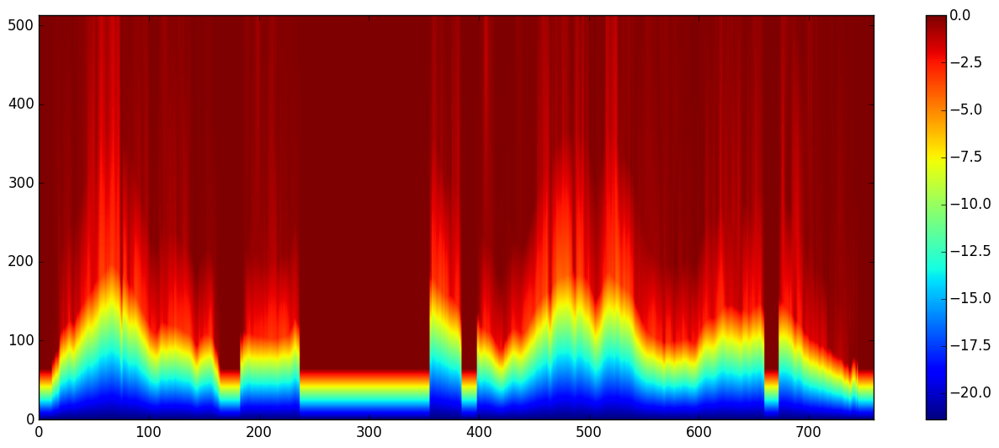
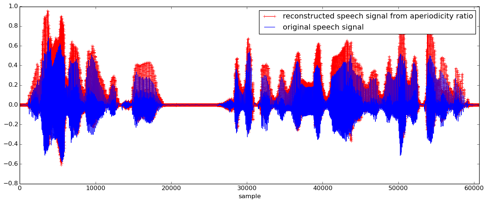

# WORLD.jl

[](https://travis-ci.org/r9y9/WORLD.jl)

WORLD.jl is a Julia wrapper for WORLD - a high-quality speech analysis, modification and synthesis system. WORLD provides a way to decompose a speech signal into

- Fundamental frequency (F0)
- spectral envelope
- excitation signal (or aperiodicy used in TANDEM-STRAIGHT)

and re-synthesize a speech signal from these paramters. See [here](http://ml.cs.yamanashi.ac.jp/world/english/index.html) for the original WORLD.

## Supported Platforms

- Linux
- Mac OS X

## Installation

Run the following commands on your julia interactive settion (REPL):

```julia
julia> Pkg.clone("https://github.com/r9y9/WORLD.jl")
julia> Pkg.build("WORLD")
```

All dependencies are resolved with `Pkg.clone` and `Pkg.build`.

## Usage

### Basic setup

```julia
w = World(fs, period) # fs might be 16000, 22100 or 44100, period is a frame period in msec.
```

This is not necessary but might be useful. The composite type `World` just holds sampling frequency and frame period that are used in almost all of WORLD functions. You can call WORLD functions directly as well.

Suppose `x::Vector{Float64}` is a input monoral speech signal like


### F0 estimation and refinement

#### DIO

```julia
opt = DioOption(80.0, 640, 2.0, period, 4) # f0floor, f0ceil, channels in octave, period, speed
f0, timeaxis = dio(w, x, opt=opt) # or you can write `dio(x, fs, opt=opt)` without using composite type `World`
```


#### StoneMask

```julia
f0 = stonemask(w, x, timeaxis, f0)
```


### Spectral envelope estimation

#### CheapTrick

```julia
spectrogram = cheaptrick(w, x, timeaxis, f0)
```


### Excitation signal estimation

#### Platinum

```julia
residual = platinum(w, x, timeaxis, f0, spectrogram)
```

Note that the result is spectrum of excitation signal.

### Synthesis

```julia
y = synthesis(w, f0, spectrogram, residual, length(x))
```


### Aperiodicity ratio estimation

```julia
aperiodicity = aperiodicityratio(w, x, f0, timeaxis)
```



### Synthesis from aperiodicity

```julia
y = synthesis_from_aperiodicity(w, f0, spectrogram, aperiodicity, length(x))
```



For the complete code of visualizations shown above, please check [the ijulia notebook](http://nbviewer.ipython.org/github/r9y9/WORLD.jl/blob/master/examples/Demonstration%20of%20WORLD.jl.ipynb).